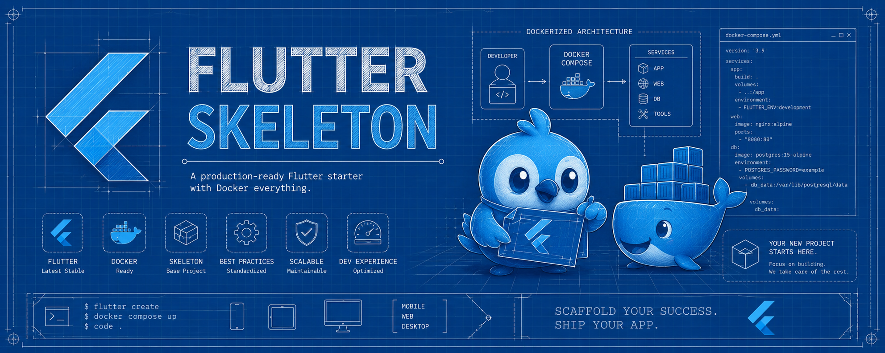

# Flutter Skeleton


**Template opinativo e moderno para Flutter** com ambiente completo em Docker.

## Sumário

- [Introdução](#introdução)
- [Stack Tecnológica](#stack-tecnológica)
- [Requisitos](#requisitos)
- [Como usar](#como-usar)
- [Comandos Make](#comandos-make)
- [Estrutura do Projeto](#estrutura-do-projeto)
- [Boas Práticas](#boas-práticas)
- [Execução local](#execução-local)
- [Recomendações Finais](#recomendações-finais)
- [Build Multi-plataforma (CI)](#build-multi-plataforma-github-actions)

## Introdução

Este repositório é um **template completo** para iniciar projetos Flutter de forma rápida e consistente.

Tudo roda dentro de um **container Docker** isolado, sem necessidade de instalar Flutter, Android SDK ou outras ferramentas diretamente na máquina host.

**Principais vantagens:**
- Ambiente 100% reprodutível.
- Suporte nativo a múltiplas plataformas.
- Stack moderna e opinativa (Riverpod + go_router + Freezed).
- CI/CD pronto com GitHub Actions.
- Fácil de ter vários projetos rodando simultaneamente.

## Stack Tecnológica

- **Gerenciamento de Estado**: [Riverpod](https://riverpod.dev/) (com [`riverpod_annotation`](https://pub.dev/packages/riverpod_annotation))
- **Navegação**: [go_router](https://pub.dev/packages/go_router)
- **HTTP**: [Dio](https://pub.dev/packages/dio) + [Retrofit](https://pub.dev/packages/retrofit)
- **Modelos**: [Freezed](https://pub.dev/packages/freezed) + [json_serializable](https://pub.dev/packages/json_serializable)
- **Injeção de Dependência**: [Riverpod](https://riverpod.dev/)
- **Logging**: [logger](https://pub.dev/packages/logger)
- **Geração de Código**: [build_runner](https://pub.dev/packages/build_runner)
- **Outros**:
  - [flutter_native_splash](https://pub.dev/packages/flutter_native_splash)
  - [flutter_launcher_icons](https://pub.dev/packages/flutter_launcher_icons)

## Requisitos

- Linux (testado em Fedora e Ubuntu).
- Docker + Docker Compose v2.
- `git` e `make`.
- Servidor X11 (para desktop Linux).

> **macOS / Windows**: Use WSL2 (Linux) ou adapte o `compose.yml`.

## Como usar

### 1. Criar um novo projeto (recomendado)

```bash
bash <(curl -fsSL https://raw.githubusercontent.com/Diego-Brocanelli/flutter-skeleton/main/install.sh)
```

O script vai:
1. Perguntar nome do projeto.
2. Perguntar plataformas desejadas.
3. Clonar, configurar e criar o projeto com a stack completa.
4. Abrir o shell dentro do container.

### 2. Comandos diários (após criação)

```bash
make up          # Subir container
make shell       # Entrar no container
make analyze     # Análise estática
make format      # Formatar código
make gen         # Gerar código (freezed, riverpod, etc.)
```

### 3. Uso manual (sem install.sh)

```bash
git clone https://github.com/Diego-Brocanelli/flutter-skeleton.git meu-app
cd meu-app
rm -rf .git && git init

echo "PROJECT_NAME=meu-app" > .env
echo "PLATFORMS=android,linux" >> .env

make build
make up
make shell
```

## Comandos Make

| Comando           | Descrição                                      |
|-------------------|------------------------------------------------|
| `make build`      | Builda a imagem Docker                         |
| `make up`         | Sobe o container                               |
| `make down`       | Para o container                               |
| `make shell`      | Abre shell dentro do container                 |
| `make analyze`    | Executa análise estática                       |
| `make format`     | Formata o código                               |
| `make fix`        | Aplica correções automáticas                   |
| `make gen`        | Gera código (Freezed, Riverpod, etc.)          |
| `make test`       | Executa testes                                 |
| `make build-app`  | Gera builds de release (Android + Linux)       |
| `make clean`      | Remove container e caches                      |

## Estrutura do Projeto

Após a instalação, seu projeto segue esta estrutura:

```bash
lib/
├── main.dart
└── src/
    ├── core/           # tema, router, di, config
    ├── features/       # Feature-first
    │   └── home/
    │       ├── data/
    │       ├── domain/
    │       └── presentation/
    └── shared/         # widgets, extensions, models comuns
```

## Boas práticas

**✅ Boas Práticas da Comunidade Dart (Effective Dart)**

Adote as diretrizes oficiais do **[Effective Dart](https://dart.dev/effective-dart)** para manter o código consistente, legível e fácil de manter.

### 1. Formatação e Estilo
- Sempre execute `dart format .`
- Linhas preferencialmente **≤ 80 caracteres**
- Use `{}` em **todos** os blocos de fluxo

```dart
// Bom
if (condition) {
  doSomething();
}

// Ruim
if (condition) doSomething();
```

### 2. Convenções de Nomenclatura

```dart
// Tipos
class UserProfile {}          // UpperCamelCase
enum UserRole {}              // UpperCamelCase
extension StringExtensions on String {} // UpperCamelCase

// Arquivos e pastas
// meu_app.dart, user_repository.dart, lib/src/

// Variáveis, funções e parâmetros
final userName = 'João';
void fetchUserData(String userId) { ... } // lowerCamelCase

// Constantes (prefer lowerCamelCase)
const defaultTimeout = Duration(seconds: 30);
const maxRetryCount = 3;
```

**Evite:**
```dart
const MAX_RETRY_COUNT = 3;        // SCREAMING_CAPS (evite em novo código)
var mUser;                        // notação húngara
```

### 3. Imports e Ordenação

```dart
// dart: primeiro
import 'dart:async';
import 'dart:convert';

// depois package:
import 'package:flutter/material.dart';
import 'package:provider/provider.dart';

// depois imports relativos
import 'src/repositories/user_repository.dart';

// exports em seção separada
export 'src/models/user.dart';
```

### 4. Estrutura de Projeto (Recomendada)

```bash
lib/
├── main.dart
└── src/
    ├── core/           # tema, router, di, config
    ├── features/       # Feature-first
    │   └── home/
    │       ├── data/
    │       ├── domain/
    │       └── presentation/
    └── shared/         # widgets, extensions, models comuns
test/
```

### 5. Documentação

```dart
/// Recupera o perfil do usuário.
///
/// Se o usuário não existir, retorna `null`.
/// 
/// ```dart
/// final user = await userService.getProfile('123');
/// ```
User? getProfile(String userId) { ... }
```

### 6. Boas Práticas de Código (Flutter/Dart)

```dart
// Prefira const
const button = ElevatedButton(
  onPressed: null,
  child: Text('Salvar'),
);

// Null safety
final name = user?.name ?? 'Anônimo';
final email = user!.email; // só use ! quando tiver certeza

// Evite funções grandes
// Bom:
class UserRepository {
  Future<User> getUser(String id) async { ... }
}

// Use final quando possível
final theme = Theme.of(context);
```

### 7. Performance & Boas Práticas Flutter

```dart
// Widgets
class UserCard extends StatelessWidget {
  const UserCard({super.key, required this.user}); // const constructor

  final User user;

  @override
  Widget build(BuildContext context) { ... }
}

// Evite rebuilds desnecessários com const e gerenciamento de estado adequado
```

## Execução local

Depois de subir o ambiente (`make up` e `make shell`), você pode rodar o projeto diretamente com os comandos do Flutter, escolhendo a plataforma desejada.

### Listar dispositivos/plataformas disponíveis

```bash
flutter devices
```

### Android

```bash
flutter run -d android
```

### Linux (Desktop)

> O compartilhamento do X11 com o container já vem configurado no `compose.yml`
> (`DISPLAY`, socket `/tmp/.X11-unix` e `network_mode: host`). Você só precisa
> garantir que o container tenha permissão para acessar o servidor X11 do host:
>
> ```bash
> xhost +local:docker
> ```

```bash
flutter run -d linux
```

### Web

```bash
flutter run -d chrome
```

### iOS

> Disponível apenas em ambientes com macOS/Xcode configurado (fora do escopo padrão deste template, que é focado em Linux/Docker).

```bash
flutter run -d ios
```

### macOS (Desktop)

> Disponível apenas em ambientes com macOS.

```bash
flutter run -d macos
```

### Windows (Desktop)

> Disponível apenas em ambientes com Windows.

```bash
flutter run -d windows
```

### Rodando em modo release

Para testar uma build de produção localmente:

```bash
flutter run --release -d <plataforma>
```

Substitua `<plataforma>` por `android`, `linux`, `chrome`, `ios`, `macos` ou `windows`.

## Recomendações Finais
- Rode sempre o linter (`analysis_options.yaml`).
- Escreva testes.
- Mantenha widgets pequenos e reutilizáveis.
- Escolha **uma** solução de gerenciamento de estado e seja consistente (ex: Riverpod, Bloc).

**Referência principal**: [Effective Dart](https://dart.dev/effective-dart)

### O que é o `analysis_options.yaml`?

É o arquivo de **configuração do analisador estático do Dart** (o `dart analyze`).

Ele permite que você defina:
- Quais regras do **linter** devem ser ativadas/desativadas
- Quais erros devem ser tratados como warnings ou erros graves
- Regras personalizadas do time/projeto

Esse arquivo é fundamental para manter o código seguindo as **boas práticas** da comunidade Dart/Flutter de forma automática.

Ele fica na raiz do projeto mesmo nível do `pubspec.yaml`).

**Como usar?**

No terminal, execute os comandos.

```bash
make shell
dart analyze
```

Ou configure seu editor (VS Code / Android Studio) para analisar automaticamente.

## Build Multi-plataforma (GitHub Actions)

O template já inclui CI/CD completo. Configure os Secrets no GitHub (`PLATFORMS` e opcionalmente `PROJECT_NAME`) para builds automáticos de todas as plataformas selecionadas.
